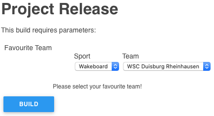
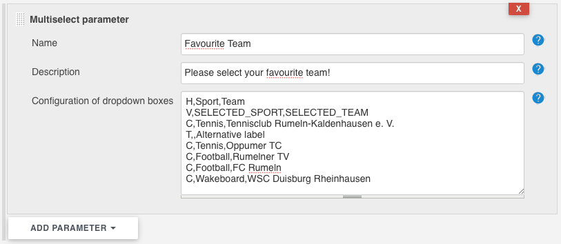

# Multiselect Parameter Plugin

[](https://ci.jenkins.io/job/Plugins/job/multiselect-parameter-plugin/job/main/)
[](https://github.com/jenkinsci/multiselect-parameter-plugin/graphs/contributors)
[](https://plugins.jenkins.io/multiselect-parameter)
[](https://github.com/jenkinsci/multiselect-parameter-plugin/releases/latest)
[](https://plugins.jenkins.io/multiselect-parameter)

## Introduction

The Multiselect parameter plugin is an extension to Jenkins parameterized builds. It allows Jenkins users to 
create more complex variables consisting of a configurable number of interdependent drop down boxes.



## Getting started

As soon as the plugin has been installed in Jenkins, freestyle jobs offer a new type of build parameters, 
named "Multiselect parameter". A simple form allows the configuration of a parameter name, a description
and a CSV configuration to use in creation of dependency tree.

There are four different types of rows used to describe the parameter and its values/variables:

* H: header labels for the drop down boxes, one per variable
* V: variable names used as environment variables in build process
* T: titles for the content items in the following row (optional, fallback is the content itself as a label)
* C: the content items that will be passed in the environment variables upon selection

The rows "H" and "V" only appear once as first and second row. The rows "T" and "C" are repeated.

Note: the "T" rows are optional, but may be useful for more technical content values that need a little bit of extra explanation.



## Example 

In the following simple example, the "build with parameters" step requests to select a favourite team in
a number of sports categories and countries.
 
```csv
H,Sport,Team
V,SELECTED_SPORT,SELECTED_TEAM
C,Tennis,Tennisclub Rumeln-Kaldenhausen e. V.
T,,Alternative label
C,Tennis,Oppumer TC
C,Football,Rumelner TV
C,Football,FC Rumeln
C,Wakeboard,WSC Duisburg Rheinhausen
```

This will display two drop down boxes. One with the label "Sport", one with the label "Team".
The first drop down box contains the values "Tennis", "Football" and "Wakeboard", the second will only hold the values "Tennisclub Rumeln-Kaldenhausen e. V." and "Oppumer TC".
When the first value is switched to "Wakeboard", the second drop down boxes content will change to "WSC Duisburg Rheinhausen".
As soon as the build is started, the environment variables SELECTED_SPORT and SELECTED_TEAM will contain the selected values.
